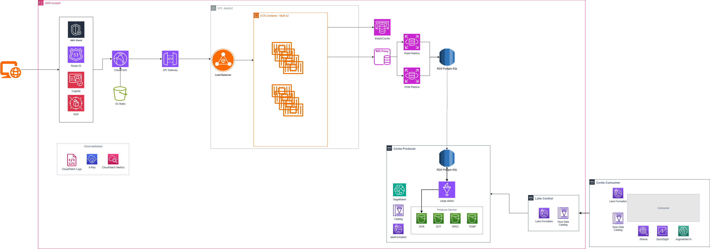

# Sistema de Gestão de Clientes - Case Técnico de Engenharia de Software

Este repositório contém a implementação de uma solução full-stack para um Sistema de Gestão de Clientes, desenvolvida como um case técnico para demonstrar excelência em arquitetura de software moderna, segurança de aplicações e estratégias de escalabilidade. O projeto abrange desde a concepção da API backend até a interface frontend, culminando em um plano detalhado para implantação em um ambiente de produção na nuvem AWS.

## O Desafio 🎯

O objetivo central deste desafio foi desenvolver um Sistema de Gestão de Clientes seguro, robusto e escalável, que personifica o rigor arquitetural e os padrões de segurança exigidos no setor de tecnologia financeira.

### Objetivos Chave
- **Desenvolver uma API Backend Robusta**: Utilizar Node.js para construir um backend resiliente, fundamentado nos princípios da Clean Architecture e Domain-Driven Design (DDD).
- **Construir uma Interface Frontend Reativa**: Criar uma interface de usuário moderna e fluida com Angular 16, garantindo uma experiência de usuário de alta qualidade.
- **Implementar Segurança Multi-camadas**: Aplicar um sistema de defesa em profundidade para proteger a aplicação contra vulnerabilidades web comuns, como DoS, SQL Injection e XSS.
- **Garantir a Integridade de Dados**: Implementar uma solução para o gerenciamento de operações concorrentes, um requisito crítico para a consistência de dados em sistemas transacionais.
- **Projetar para a Nuvem**: Delinear uma arquitetura na AWS capaz de escalar horizontalmente para atender a uma demanda de milhares de usuários simultâneos, com alta disponibilidade e performance.

## Funcionalidades Principais 🧱
- **Gestão Completa de Clientes**: Operações CRUD (Criar, Ler, Atualizar, Excluir) para o gerenciamento de dados de clientes.
- **Transações de Saldo Seguras**: Lógica de negócio para gerenciar o saldo dos clientes, com um mecanismo robusto de proteção contra condições de corrida (*race conditions*).
- **Validação de Dados Robusta**: Validação e sanitização rigorosa de todas as entradas de dados na camada da API para prevenir ataques de injeção de SQL, Cross-Site Scripting (XSS) e outras vulnerabilidades.
- **Segurança Proativa da API**: Implementação de middlewares para *Rate Limiting*, protegendo o sistema contra ataques de negação de serviço (DoS) e força bruta, e configuração de headers de segurança via Helmet.js.
- **Interface de Usuário Reativa**: Frontend desenvolvido com Angular e programação reativa (RxJS) para uma experiência de usuário dinâmica, responsiva e eficiente.

## Arquitetura e Estrutura 🏛️

### Filosofia Arquitetural
A solução adota uma abordagem híbrida que combina *Layered Architecture*, *Clean Architecture* e princípios de *Domain-Driven Design* (DDD). Essa escolha estratégica não é acidental; ela cria uma sinergia poderosa que resulta em um sistema organizado, de fácil manutenção e estritamente alinhado às regras de negócio.

A *Layered Architecture* estabelece uma clara separação de responsabilidades. A *Clean Architecture*, com sua regra de dependência, garante que a lógica de negócio (*services*) permaneça independente de detalhes de infraestrutura (como o framework web ou o acesso a dados), tornando o núcleo do sistema altamente testável e agnóstico a tecnologias externas. Finalmente, o DDD assegura que o código seja um reflexo fiel do domínio do negócio, o que é fundamental em contextos financeiros onde a precisão das regras é primordial.

### Stack Tecnológica 🛠️

| Categoria       | Tecnologia         | Finalidade                                                  |
|-----------------|-------------------|-------------------------------------------------------------|
| **Backend**     | Node.js           | Runtime JavaScript para o servidor                          |
|                 | Express.js        | Framework web minimalista para a construção da API          |
|                 | SQLite3           | Banco de dados relacional para desenvolvimento local         |
|                 | Helmet.js         | Middleware de segurança para proteção de headers HTTP       |
|                 | CORS              | Controle de acesso entre domínios (Frontend/Backend)        |
|                 | Express-validator | Validação e sanitização de dados de entrada                 |
| **Frontend**    | Angular 16        | Framework TypeScript para a construção da UI                |
|                 | Angular Material  | Biblioteca de componentes UI com Material Design           |
|                 | RxJS              | Biblioteca para programação reativa                         |
|                 | TypeScript        | Superset tipado do JavaScript para código robusto           |

## Estrutura Detalhada do Backend (Node.js)
A organização do backend é uma manifestação física da filosofia arquitetural adotada, garantindo que cada componente tenha uma responsabilidade única e bem definida. O fluxo de uma requisição segue um caminho claro (*Controller -> Service -> Repository*), reforçando a separação de interesses.

```
src/
├── config/          # Configurações da aplicação (ex: banco de dados)
├── controllers/     # Camada de Apresentação: recebe requisições HTTP e retorna respostas
├── services/        # Camada de Serviço: contém as regras de negócio centrais
├── repositories/    # Camada de Repositório: abstrai o acesso e a persistência de dados
├── models/          # Camada de Domínio: define as entidades e objetos de valor (DDD)
├── middlewares/     # Middlewares: funções para tratamento de segurança, erros, etc.
└── utils/           # Utilitários: helpers e soluções para problemas transversais
```

A existência de um diretório `middlewares/` dedicado demonstra uma abordagem proativa para tratar de preocupações transversais, como segurança e manipulação de erros, que é uma marca de APIs bem projetadas. O diretório `utils/`, contendo a solução `TransactionQueue`, evidencia a capacidade de engenharia para resolver problemas complexos e específicos do domínio.

## Estrutura Detalhada do Frontend (Angular)
O frontend segue a arquitetura modular e baseada em componentes do Angular, promovendo a reutilização de código e a manutenibilidade.

```
src/app/
├── components/      # Componentes de apresentação (UI)
│   ├── cliente-lista/
│   └── dialogs/
├── services/        # Serviços: encapsulam a comunicação com a API backend
├── models/          # Modelos: interfaces TypeScript para tipagem de dados
└── app-routing.module.ts  # Configuração de rotas da aplicação
```

## Decisões Arquiteturais e Implementações Chave 🧠

### Controle de Concorrência: A Solução `TransactionQueue`
Um dos desafios mais críticos em sistemas transacionais é garantir a consistência dos dados sob alta concorrência. O SQLite, por padrão, possui limitações no tratamento de múltiplas escritas simultâneas. Para resolver isso, foi implementado o `TransactionQueue.js`, um utilitário que utiliza o **Queue Pattern** para serializar operações de banco de dados que modificam o saldo de clientes.

Esta solução previne **condições de corrida** (*race conditions*), onde duas operações tentam alterar o mesmo dado ao mesmo tempo, o que poderia levar a um saldo inconsistente. Ao enfileirar e executar as transações sequencialmente, o sistema garante a conformidade com as propriedades **ACID** (Atomicidade, Consistência, Isolamento e Durabilidade), assegurando a integridade financeira dos dados. A engenharia dessa solução demonstra um entendimento profundo dos princípios de banco de dados e controle de concorrência, indo além do uso de ferramentas prontas para resolver um problema fundamental.

### Garantia de Idempotência: A Solução `idempotencyMiddleware`
Em sistemas distribuídos, é comum que um cliente repita uma requisição devido a falhas de rede ou *timeouts*, sem saber se a operação original foi concluída. Para operações que modificam dados (como criar um cliente ou realizar uma transação financeira com `POST`), isso poderia levar a duplicatas indesejadas. O `idempotencyMiddleware.js` foi criado para resolver exatamente este problema.

Idempotência é a propriedade que garante que múltiplas requisições idênticas tenham o mesmo efeito que uma única requisição. O middleware implementa essa garantia através de uma **chave de idempotência** (`Idempotency-Key`). O fluxo funciona da seguinte forma:
1. O cliente gera uma chave única (ex: um UUID) para cada operação e a envia no header `Idempotency-Key` da requisição.
2. O `idempotencyMiddleware` intercepta a requisição e verifica se já processou uma operação com aquela chave.
3. Se a chave é nova, o middleware permite que a requisição prossiga para a lógica de negócio, armazena a resposta resultante em cache associada à chave e, em seguida, a retorna ao cliente.
4. Se a chave já existe, o middleware bloqueia a execução da lógica de negócio e retorna imediatamente a resposta que foi armazenada na primeira vez.

Essa abordagem torna operações inerentemente não idempotentes, como `POST`, seguras para serem repetidas, garantindo a integridade dos dados e a confiabilidade do sistema.

### Middlewares de Segurança e Validação
A segurança da API é tratada como uma estratégia de "defesa em profundidade", onde múltiplas camadas de proteção trabalham em conjunto.
- **`RateLimiter`**: Implementa uma limitação de taxa de requisições customizada (100 requisições por IP a cada 15 minutos) para mitigar ataques de negação de serviço (DoS) e de força bruta.
- **`IdempotencyMiddleware`**: Previne o processamento duplicado de requisições que modificam dados, garantindo a consistência e a integridade do sistema em cenários de falhas de rede ou retentativas do cliente.

A criação desses middlewares demonstra uma mentalidade focada em resiliência operacional e segurança, antecipando desafios do mundo real que vão além da simples implementação de funcionalidades.

## Estratégia de Segurança Multi-camadas 🛡️

A segurança é um pilar fundamental do projeto, abordada de forma holística em todas as camadas da aplicação.

### Segurança no Backend
- **Proteção de Headers (Helmet.js)**: Configura headers HTTP essenciais, como `Content-Security-Policy` (CSP), `X-Frame-Options` (anti-clickjacking) e `Strict-Transport-Security` (HSTS).
- **Política de CORS**: Controla rigorosamente quais domínios podem acessar a API, prevenindo ataques como *Cross-Site Request Forgery* (CSRF).
- **Validação de Entrada**: Sanitização e validação de todos os *inputs* para neutralizar vetores de ataque comuns.
- **Segurança Transacional**: Garantia de atomicidade e consistência em operações críticas através da `TransactionQueue`.

### Segurança no Frontend
- **Proteção Nativa do Angular**: O framework oferece proteção automática contra ataques de *Cross-Site Scripting* (XSS) ao sanitizar valores antes de renderizá-los no DOM.
- **Tipagem Forte com TypeScript**: O uso do TypeScript previne uma vasta classe de erros em tempo de execução que poderiam, em alguns casos, levar a vulnerabilidades de segurança. A verificação de tipos em tempo de compilação garante um código mais seguro e previsível.

A atenção à segurança tanto no *frontend* quanto no *backend* demonstra uma compreensão completa do ciclo de vida dos dados e das responsabilidades de um engenheiro *full-stack*.

## Como Executar o Projeto 🚀

### Pré-requisitos
- **Node.js**: Versão 14.x ou superior (`node --version`)
- **Git**: (`git --version`)

### Backend (API)
1. Navegue até a pasta raiz do backend:
   ```bash
   cd nodeAPIcase
   ```
2. Instale as dependências:
   ```bash
   npm install
   ```
3. Inicie o servidor:
   ```bash
   node server.js
   ```
   O backend estará rodando em `http://localhost:8080`.

### Frontend (Angular)
1. Em um novo terminal, navegue até a pasta do frontend:
   ```bash
   cd frontend
   ```
2. Instale as dependências:
   ```bash
   npm install
   ```
3. Inicie o servidor de desenvolvimento:
   ```bash
   npm start
   ```
   O frontend estará acessível em `http://localhost:4200`.

## Testes e Validação 🧪

Para validar a robustez da aplicação, especialmente a solução de concorrência, testes foram desenvolvidos.

1. Instale a dependência de teste (se necessário):
   ```bash
   npm install axios --save-dev
   ```
2. Navegue até a pasta de testes do backend:
   ```bash
   cd tests
   ```
3. Execute os testes:
   ```bash
   npm test
   ```
   ou para o teste de concorrência específico:
   ```bash
   node concurrent-transactions.test.js
   node idempotency.test.js
   ```

Você também pode interagir com a API usando `curl`. Exemplo para criar um cliente:
```bash
curl -X POST http://localhost:8080/clientes -H "Content-Type: application/json" -d '{
  "nome": "Cliente Teste",
  "email": "teste@example.com",
  "saldo": 5000
}'
```

## Plano de Escalabilidade para Produção (AWS) ☁️

Para transformar este projeto de um protótipo local em um serviço de produção capaz de suportar 5.000 usuários simultâneos, foi projetada uma arquitetura *cloud-native* na AWS. Esta arquitetura aborda diretamente as limitações da implementação local (como o uso do SQLite e a execução em um único processo) e introduz alta disponibilidade, escalabilidade e segurança robusta.

### Arquitetura AWS Proposta


### Serviços AWS Utilizados e Finalidade

| Serviço                  | Finalidade                                                                 |
|--------------------------|---------------------------------------------------------------------------|
| **Route 53**             | Serviço de DNS global para direcionar o tráfego para a aplicação.          |
| **CloudFront**           | CDN para distribuir o frontend (*assets* estáticos) com baixa latência e cache. |
| **S3**                   | Armazenamento de objetos para hospedar os arquivos do frontend Angular.    |
| **AWS Shield**           | Proteção gerenciada contra ataques de negação de serviço (DDoS).           |
| **AWS WAF**              | Firewall de aplicação web para proteger contra explorações como SQL Injection e XSS. |
| **Cognito**              | Serviço de autenticação e autorização de usuários, gerenciando logins e controle de acesso. |
| **Application Load Balancer (ALB)** | Distribui o tráfego de entrada entre múltiplos contêineres do backend.     |
| **ECS com Fargate**      | Orquestração de contêineres *serverless* para executar a aplicação backend sem gerenciar servidores. |
| **AWS Lambda**           | Execução de lógica de negócio desacoplada e orientada a eventos (ex: notificações, processamento assíncrono). |
| **Auto Scaling**         | Ajusta automaticamente o número de contêineres com base na demanda (CPU/Memória). |
| **RDS PostgreSQL**       | Banco de dados relacional gerenciado, persistente, escalável e com alta disponibilidade. |
| **ElastiCache (Redis)**  | Cache em memória para armazenar dados frequentemente acessados, reduzindo a carga no banco de dados. |
| **CloudWatch**           | Coleta de logs, métricas e configuração de alarmes para monitoramento e observabilidade. |
| **X-Ray**                | Rastreamento distribuído para analisar e depurar o fluxo de requisições através dos serviços. |
| **Secrets Manager**      | Gerenciamento seguro de credenciais de banco de dados e outras chaves secretas. |

## Estimativa de Custo e Roadmap de Implementação

### Estimativa de Custo Mensal (AWS)

| Custo Total Estimado | Custo Otimizado         |
|-----------------------|-------------------------|
| ~$411/mês            | ~$300-350/mês           |


## Análise de Maturidade e Próximos Passos 📈

Este projeto estabelece uma base sólida, mas a engenharia de software é um processo de melhoria contínua. A seguir, uma análise dos pontos fortes e um *roadmap* para a evolução do sistema.

### Pontos Fortes da Implementação
- **Arquitetura Robusta**: A clara separação de responsabilidades e o baixo acoplamento facilitam a manutenção e a evolução do código.
- **Segurança em Camadas**: A abordagem de "defesa em profundidade" torna a aplicação resiliente a ameaças comuns.
- **Controle de Concorrência**: A solução *TransactionQueue* garante a integridade dos dados, um diferencial crítico para a aplicação.
- **Código Moderno e Tipado**: O uso de TypeScript e funcionalidades modernas do JavaScript (*async/await*) resulta em um código mais seguro e legível.

### Roadmap de Evolução
A lista a seguir não representa falhas, mas sim um *backlog* priorizado para futuras iterações de desenvolvimento, transformando o projeto em uma solução ainda mais completa e pronta para produção.

**Prioridade Alta:**
- Implementar Autenticação e Autorização com JWT: Proteger os endpoints da API para que apenas usuários autenticados possam acessá-los.
- Adicionar *Logging* Estruturado: Implementar um sistema de *logs* robusto (ex: Winston, Pino) para facilitar a depuração e o monitoramento.
- Implementar Paginação: Adicionar paginação nas listagens de clientes para otimizar a performance com grandes volumes de dados.

**Prioridade Média:**
- Aumentar a Cobertura de Testes: Adicionar mais testes unitários, de integração e E2E para garantir a qualidade e a estabilidade.
- Adicionar *Health Checks*: Criar um endpoint `/health` para que o Load Balancer possa monitorar a saúde da aplicação.

## Autor ✍️
Case desenvolvido por:  Gustavo Nascimento Aguilar
**Repositório do Projeto**: [https://github.com/Gubisss/case_itau_nodejs](https://github.com/Gubisss/case_itau_nodejs)